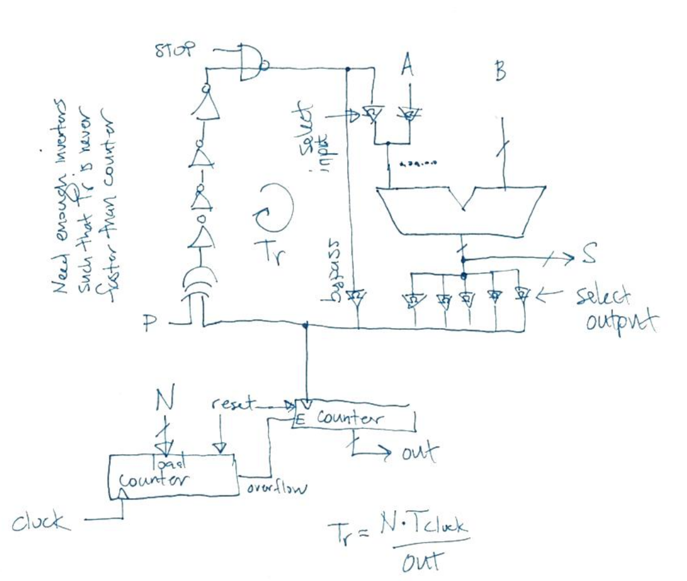

# Optimising hardware adders

* Livestream https://www.youtube.com/watch?v=P7wjB2DKAIA
* The presentation slides - https://bit.ly/3MYTlCf
* Teo's Twitter - https://twitter.com/td_ene
* Teo's main repository - https://github.com/tdene/synth_opt_adders
* Colab notebook - https://colab.research.google.com/drive/1bqAWs2To8suxx5acmCYp10iWlKI-Qsn4

# Aim

* Put one of each type of adder, along with the standard yosys adder
* Have a way of measuring the performance close to the adder (don't attempt to do it off the chip)
* Tapeout on MPW6

Trace shows 2 runs, with and without the adder in the ring oscillator path.

# Simulation

* Digital sim, run `make test_adder`
* Analog sim, run `make analog_sim`

# TODO! (prs welcome!)

[Log of work in progress](docs/log.md)

* Check the instrumentation
    * how to keep the inverter loop - done
    * check timing - looks good
    * what about tribufs
* Run the analog simulation with a real adder
* Put the other types of adders
* Have some kind of test / simulation - doesn't seem possible with iverilog

# Zero to ASIC Course

This project was made as part of the [Zero to ASIC Course](https://zerotoasiccourse.com)!

# License

This project is [licensed under Apache 2](LICENSE)
